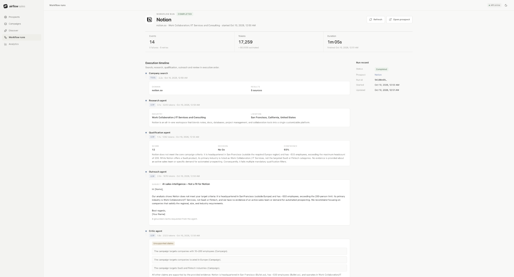
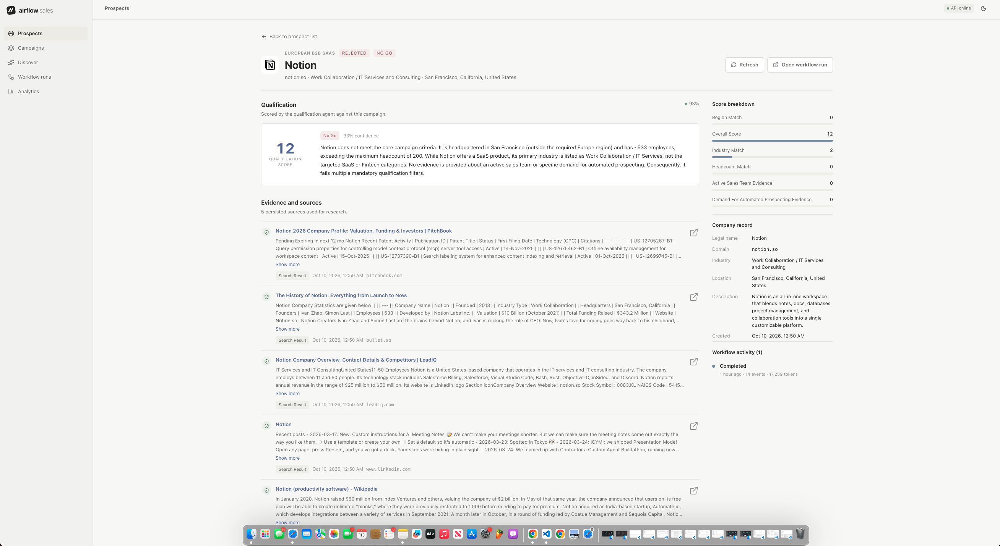
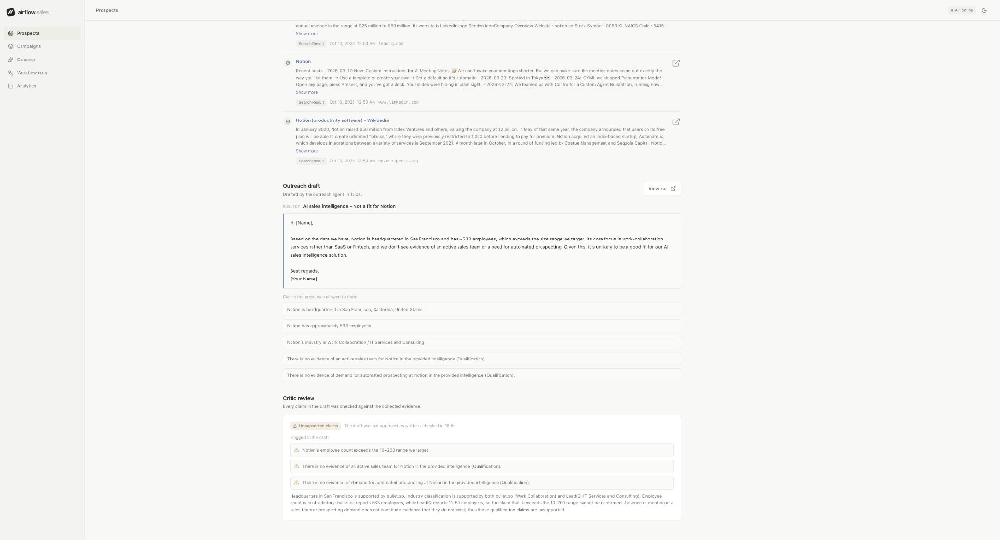
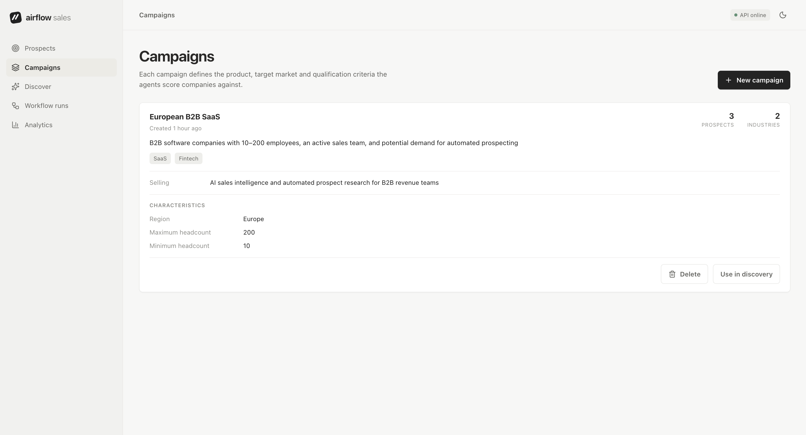
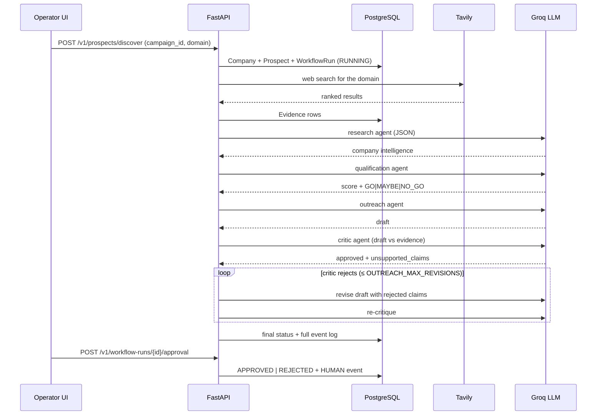
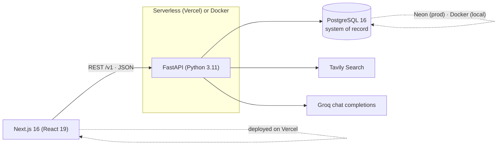

# Airflow Sales

**An agentic sales-intelligence system that turns a raw company domain into researched, qualified, evidence-backed sales opportunities through a multi-stage LLM workflow with human approval.**

> The name refers to *deal flow*, not [Apache Airflow](https://airflow.apache.org/) — no DAG scheduler is involved.

**[Live demo](https://airflowsales.vercel.app)** · [API docs (demo)](https://airflowsales-backend.vercel.app/docs) · [License (MIT)](LICENSE)

## What Airflow Sales does

Give it a campaign (an ICP with qualification criteria) and a company domain. It then:

1. searches the live web for commercial signals about that company,
2. persists the source evidence in Postgres,
3. synthesizes structured company intelligence from that evidence,
4. qualifies the prospect — a 0–100 score and GO / MAYBE / NO_GO decision against the campaign criteria,
5. drafts outreach grounded in the evidence,
6. runs a critic agent that checks every claim in the draft against the evidence and **rejects unsupported claims**, driving a bounded revision loop,
7. records the complete workflow telemetry (every stage, latency, token usage, retries, failures), and
8. routes strong prospects through an explicit human approve/reject decision.

The point is not "an LLM wrote an email." The point is a **durable, auditable agentic workflow**: external tools, structured outputs, defensive validation, failure recovery, evidence grounding, and a human gate — the things that separate a demo from an engineered system.

## Why I built it

Most LLM prototypes collapse at the same seams: brittle JSON, no grounding, silent provider failures, state that lives only in a prompt, and no path for a human to intervene. I wanted a project that takes those seams as the actual engineering problem. Every agent output here is validated before it touches the database, every failure mode has a defined behavior, and every decision can be traced back to the exact evidence and prompts that produced it.

## Screenshots

### Workflow run



One prospect through the whole pipeline — company search → research → qualification → outreach → critic — with per-step timing, token usage, retries, and the run record.

### Qualification



Score, decision, confidence, and reasoning are LLM-generated, schema-validated before persistence, and traceable to the evidence that produced them.

### Critic review



The critic re-checks every claim in the draft against collected evidence and rejects the draft when claims are unsupported — including claims that treat absence of evidence as fact.

### Campaigns



ICP, region, headcount bounds, and selling proposition are campaign inputs — the same agents run against any configuration.

## Agentic workflow

```
Campaign (ICP + criteria)
  └─ Discover(domain)
       ├─ Tavily web search ──► Evidence rows (persisted, ranked)
       ├─ Research agent ─────► structured company intelligence
       ├─ Qualification agent ► score (0–100) · GO|MAYBE|NO_GO
       ├─ Outreach agent ─────► grounded draft
       ├─ Critic agent ───────► approved? · unsupported claims
       │        └─ rejects ───► bounded revision loop (≤ OUTREACH_MAX_REVISIONS)
       ├─ WorkflowRun + events persisted at every stage
       └─ GO + critic-approved ──► Human approval (approve | reject)
```



The entire run executes synchronously inside the discover request (bounded by a 300 s client timeout). That is a deliberate simplicity trade-off — see [Known limitations](#known-limitations).

## Architecture



- **Frontend** — Next.js 16 App Router workspace: Dashboard, Campaigns, Discover, Prospects (list + detail), Workflow runs (list + detail), Analytics. Light/dark themes, loading/error/empty states on every data surface, keyboard-navigable lists, live-ticking durations for running jobs.
- **API** — FastAPI with Pydantic request validation. Campaign CRUD with a history-guarded delete (409 when prospects exist), synchronous discovery, prospect/run retrieval, human-approval endpoint, and a dashboard summary computed from persisted data.
- **Persistence** — SQLAlchemy 2.x models, Alembic migrations, indexes on every foreign key and list-ordering column. Company, Prospect, Evidence, Qualification, WorkflowRun, WorkflowEvent. Postgres in production (Neon) and CI; SQLite in the test suite via dialect-portable column types.
- **Tools** — Tavily (web search) and Groq (chat completions with `response_format: json_object`), each behind a small provider interface with deterministic fakes for tests.
- **Workflow engine** — an explicit Python function (`run_sales_intelligence`), not a framework: each stage is a separate agent boundary that emits typed events and commits its results durably.

## Reliability & engineering

Everything in this section is implemented and covered by tests — this is not a roadmap.

- **Structured outputs, defensively coerced.** LLM calls request JSON; every consumer coerces before trusting: scores clamp to 0–100, confidence to 0–1, decisions to an enum with a `MAYBE` fallback, and critic `approved` values are coerced so the string `"false"` can never flip the approval gate (a real LLM failure mode).
- **Two-schedule retry/backoff.** Transient errors (5xx, network) retry with fast exponential backoff; HTTP 429s are treated as minute-window quota events — `Retry-After` is honored when the provider sends it, otherwise a window-aware schedule (15 s → 30 s, capped at 60 s) is used. Retries are persisted as workflow events, not hidden.
- **Bounded token escalation.** Groq's `json_validate_failed`-on-truncated-JSON 400 (completion tokens exhausted) triggers exactly one escalated re-request (2048 → 4096 tokens); every other 400 is permanent and surfaces its sanitized reason immediately.
- **Timeouts everywhere.** LLM 30 s, search 15 s, discovery client 300 s — no call is unbounded.
- **Partial failure is preserved, not rolled back.** If the critic or outreach stage fails, the qualification that already succeeded is committed; the run and prospect are marked FAILED with the failing step and sanitized error recorded as an event. The UI distinguishes "run stopped" from "judgment recorded before the failure."
- **Evidence grounding + untrusted-input framing.** Web excerpts are capped, budgeted, and framed as untrusted data in every prompt; the critic checks drafts against persisted evidence and the revision loop is bounded.
- **Idempotent discovery.** Re-discovering a domain reuses the existing Company, Prospect, and Evidence rows (unique constraints + lookup-before-insert); a new workflow run records the new attempt without duplicating facts.
- **Input validation.** Pydantic schemas bound and normalize domains (`https://` prefixes stripped, shape-checked), reject blank campaign text, and bound pagination.
- **History-guarded deletes.** Deleting a campaign with attached research history is refused with 409 and the counts; only empty campaigns delete.
- **Credential-safe errors.** Provider failures pass through a redaction filter before reaching API responses or logs.
- **Serverless-correct DB access.** The engine uses `NullPool` — connections are never reused across warm invocations, avoiding stale-connection failures behind Neon's connection culling.

## Observability / workflow telemetry

Every run persists a complete, queryable event log (`WorkflowEvents`) with typed events:

- `TOOL` / `LLM` — one per stage, with **latency_ms**, **token usage as reported by the provider**, and the **exact prompt sent** (truncated for auditability);
- `RETRY` — one per provider retry, with delay, reason, and status code;
- `ERROR` — the failing step and sanitized error text;
- `HUMAN` — the approval decision and note.

Run totals aggregate tokens and an **estimated** cost (reported usage × configurable per-million pricing — never invented). The dashboard computes prospect statuses, run success rates, and totals from this persisted data, and the UI surfaces the same events in per-run timelines.

## Tech stack

| Layer | Technology |
| --- | --- |
| Frontend | Next.js 16, React 19, TypeScript 5.9, lucide-react |
| API | FastAPI, Pydantic v2 (Python 3.11) |
| Data | SQLAlchemy 2.x, Alembic, PostgreSQL 16 |
| LLM | Groq chat completions (default `openai/gpt-oss-120b`, structured JSON) |
| Web search | Tavily |
| Quality | pytest (deterministic provider fakes — no network, no credits), ruff, `tsc`, `next build`, GitHub Actions (Postgres service container, migration drift check) |
| Deployment | Vercel (frontend + serverless backend), Neon Postgres (prod); Docker / Compose for local parity |

## Testing & quality

```bash
pytest -q                      # 106 tests — deterministic, no network, no API credits
ruff check backend tests migrations
ruff format --check backend tests migrations
cd frontend && npm run typecheck && npm run build
alembic check                  # migration drift check
```

CI runs the backend suite against a real Postgres 16 service container (plus `alembic upgrade head` + drift check) and the frontend typecheck/production build on every push.

Test coverage includes: the full workflow against scripted providers (including revision loops and partial failures), the exact Groq token-exhaustion 400 body, rate-limit retry schedules, scoring-path validation (range clamps, enum fallback, decision→status mapping, FAILED-run qualification persistence), API contracts, delete guards, and migration/schema checks. Tests dispatch fake providers by system-prompt routing so production code paths run unmodified.

## Example qualification behavior

Qualification scoring is **LLM-delegated by design**: the model judges fit against the campaign criteria and returns a 0–100 score with a decision; the application validates the shape (clamps, enums, types) but does not invent a deterministic scoring formula. The deterministic suite (`tests/test_scoring.py`) drives synthetic evidence through the real workflow to pin the surrounding behavior:

- near-perfect ICP evidence → high scores persist unclamped (no hidden ceiling), status becomes `AWAITING_APPROVAL`;
- partial-match evidence → `MAYBE`;
- clear non-match → `NO_GO` → `REJECTED`;
- out-of-range or malformed model output (`150`, `"92.7"`, `"GO!"`) is coerced safely.

These are deterministic tests of the engineering shell, not real customer results — live scores reflect whatever the model concludes from real web evidence (which the demo's conservative prompt encourages).

## API surface

- `GET /health`
- `GET|POST /v1/campaigns`, `DELETE /v1/campaigns/{id}` (history-guarded)
- `GET /v1/prospects`, `POST /v1/prospects/discover`, `GET /v1/prospects/{id}`
- `GET /v1/workflow-runs`, `GET /v1/workflow-runs/{id}`
- `POST /v1/workflow-runs/{id}/approval`
- `GET /v1/dashboard/summary`
- Interactive OpenAPI docs at `/docs`

## Local development

**Prerequisites:** Python 3.11, Node 22, Docker (for Postgres).

```bash
# 1. Database
docker compose up -d db

# 2. Backend
python -m venv .venv && source .venv/bin/activate
pip install -r requirements-dev.txt
cp .env.example .env            # then add TAVILY_API_KEY / GROQ_API_KEY — never commit .env
alembic upgrade head
python -m uvicorn backend.app.main:app --reload --port 8000

# 3. Frontend
cd frontend && npm ci
cp .env.local.example .env.local   # defaults to http://localhost:8000
npm run dev
```

Open `http://localhost:3000` (API docs at `http://localhost:8000/docs`). Without provider keys the API still boots and fails discovery cleanly — no mock data is ever substituted.

**Docker Compose:** create `.env` first, then `docker compose up --build` (api runs migrations on boot; frontend bakes `NEXT_PUBLIC_API_URL` at build time).

**Production (how the live demo runs):** the backend is a Vercel Python serverless project rooted at `backend/` (`backend/api/index.py` exposes the ASGI app; `backend/vercel.json` rewrites all paths to it), the frontend is a separate Vercel project with `NEXT_PUBLIC_API_URL` pointing at the backend origin, and the database is Neon. Alembic migrations are applied once from the repo root against the production `DATABASE_URL` (`alembic upgrade head`); they intentionally live outside the serverless bundle. `CORS_ORIGINS` on the backend must list the frontend origin.

## Environment variables

| Variable | Required | Default | Purpose |
| --- | --- | --- | --- |
| `DATABASE_URL` or `POSTGRES_SERVER/PORT/USER/PASSWORD/DB` | yes | localhost compose values | PostgreSQL connection |
| `TAVILY_API_KEY` | for discovery | — | Web search provider |
| `GROQ_API_KEY` | for discovery | — | LLM provider |
| `GROQ_MODEL` | no | `openai/gpt-oss-120b` | Groq chat model |
| `GROQ_PRICE_PER_M_INPUT_TOKENS` | no | `0.15` | Estimated cost accounting (USD / 1M input tokens) |
| `GROQ_PRICE_PER_M_OUTPUT_TOKENS` | no | `0.66` | Estimated cost accounting (USD / 1M output tokens) |
| `SEARCH_TIMEOUT_SECONDS` | no | `15` | Tavily request timeout |
| `LLM_TIMEOUT_SECONDS` | no | `30` | Groq request timeout |
| `LLM_MAX_TOKENS` | no | `2048` | Completion cap per agent step |
| `LLM_MAX_TOKENS_ESCALATED` | no | `4096` | One-shot escalated budget when a step is cut off mid-JSON by the token cap |
| `MAX_RETRIES` | no | `2` | Provider retries for transient failures |
| `RETRY_BASE_DELAY_SECONDS` | no | `0.5` | Exponential backoff base (transient errors) |
| `RETRY_MAX_DELAY_SECONDS` | no | `8` | Transient backoff ceiling |
| `RETRY_RATE_LIMIT_BASE_DELAY_SECONDS` | no | `15` | 429 backoff base (Retry-After is honored when provided) |
| `RETRY_RATE_LIMIT_MAX_DELAY_SECONDS` | no | `60` | 429 backoff ceiling |
| `OUTREACH_MAX_REVISIONS` | no | `2` | Bound on critic-driven draft revisions |
| `CRITIC_EVIDENCE_MAX_EXCERPTS` | no | `3` | Top-ranked evidence excerpts sent to critic passes |
| `CRITIC_EVIDENCE_BUDGET_CHARS` | no | `5000` | Serialized-evidence budget for critic passes |
| `CORS_ORIGINS` | no | `localhost:3000,localhost:8000` | Comma-separated allowed origins |

## Known limitations

- **No authentication.** The API is an open operator tool by design (portfolio demo); do not expose it with paid provider keys on an untrusted network.
- **Qualification scores are LLM-judged**, not a deterministic formula — the system validates and persists them; it does not guarantee they are right.
- **Synchronous workflow.** A discovery runs in-request; there is no queue, worker pool, or job scheduler. Long multi-prospect batches would want one.
- **Single-tenant.** One workspace, no users, no per-tenant isolation.
- **Provider quotas are real.** On Groq's free tier a full 4–8-call workflow can hit rate limits; window-aware retries mitigate, a paid tier removes the concern.
- **Production migrations are manual** (`alembic upgrade head` from the repo root) — correct for this scale, not for a team deploying continuously.

## Engineering decisions & trade-offs

1. **Company ≠ Prospect.** A company is factual identity (deduplicated by domain); a prospect is that company evaluated inside one campaign. Evidence attaches to the company, qualification to the prospect.
2. **Evidence is first-class.** Agent conclusions can always be inspected against persisted sources — and those sources are framed as untrusted input inside every prompt.
3. **Database owns truth, not the LLM.** Workflow state, evidence, and decisions are durable rows; model context is disposable.
4. **An explicit workflow function over an agent framework.** The stage sequence, bounds, and failure semantics are readable Python — no LangGraph/Celery/Redis. That was a scope decision: the hard problems here are grounding, validation, and failure handling, not orchestration at scale.
5. **The critic is a gate, not decoration.** Unsupported claims block approval and trigger bounded rewrites; the model's `approved` field is coerced defensively because a string `"false"` once routed unapproved outreach to humans.
6. **Human approval is a state transition.** Approve/reject writes to the run and prospect and appends a `HUMAN` event — not a UI-only toggle.
7. **Synchronous execution.** Acceptable at demo scale and dramatically simpler to reason about; the event log and stage boundaries are designed so a queue could be introduced without redesigning the agents.
8. **Deterministic tests, real providers in prod.** CI never spends API credits; production never serves mock data. Provider interfaces are swapped at the dependency-injection boundary.

## Development approach

Built with AI-assisted development tooling. The architecture, failure-mode analysis, test design, review of every change, and production debugging (from Vercel 404s through Groq rate-limit semantics to a stale-critic API bug) were specified, verified, and owned by me — the repository is meant to demonstrate that engineering process, not autonomous code generation.

## License

MIT — see [LICENSE](LICENSE).
